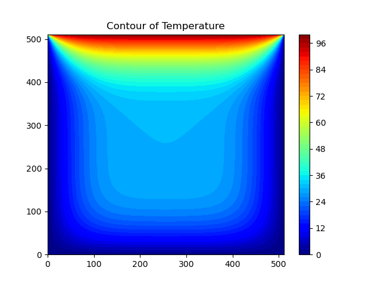
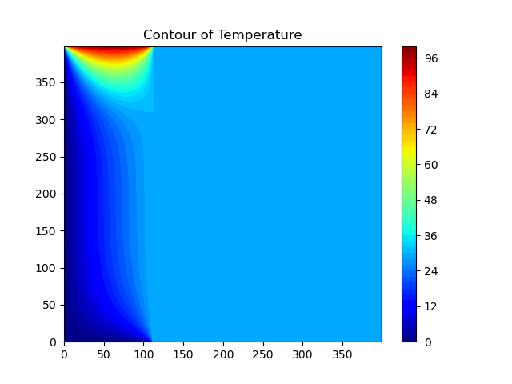
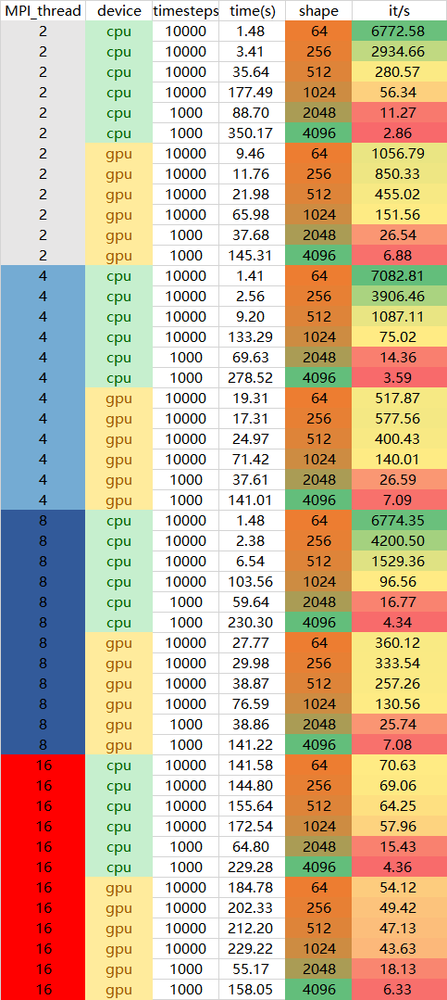

# Heat Conduction
[English](README.md) | [中文](README_CN.md)

Example implementations of two dimensional heat equation with various parallel programming approaches.

Heat (or diffusion) equation is

$$
\frac{\partial u}{\partial t} = \alpha \nabla ^2u
$$

where **u(x, y, t)** is the temperature field that varies in space and time, and α is thermal diffusivity constant. The two dimensional Laplacian can be discretized with finite differences as

$$
\nabla^2 u  = \frac{u(i-1,j)-2u(i,j)+u(i+1,j)}{(\Delta x)^2} + \frac{u(i,j-1)-2u(i,j)+u(i,j+1)}{(\Delta y)^2}
$$

Given an initial condition (u(t=0) = u0) one can follow the time dependence of the temperature field with explicit time evolution method:

$$
u^{m+1}(i,j) = u^m(i,j) + \Delta t \alpha \nabla^2 u^m(i,j)
$$

Note: Algorithm is stable only when

$$
\Delta t < \frac{1}{2 \alpha} \frac{(\Delta x \Delta y)^2}{(\Delta x)^2
 (\Delta y)^2}
$$



## Develop environment

### hardware

- CPU: Intel Core i5-12490F 6C12T
- GPU: RTX 2070 8G
- RAM: 32G DDR4 3200MHz

### software

- Python: Miniconda python3.8
- Mpi4py: 3.1.4
- pycuda: 2022.1+cuda116
- Nvidia CUDA toolkit: 11.6
- Nvidia SMI: 531.41
- CUDA: 12.1

## Code instruction

### Parameter setting

```python
if __name__ == '__main__':
    opts, _ = getopt.getopt(sys.argv[1:], 'd:t:i:l:', ['device=', 'timesteps=', 'image_interval=', 'len='])
    for opt, arg in opts:
        if opt in ('-d', '--device'):
            device = arg
        elif opt in ('-t', '--timesteps'):
            timesteps = int(arg)
        elif opt in ('-i', '--image_interval'):
            image_interval = int(arg)
        elif opt in ('-l', '--len'):
            lenX = int(arg)
            lenY = int(arg)
            X, Y = np.meshgrid(np.arange(0, lenX), np.arange(0, lenY))
    main()
```

When calling this python file, parameters can be added. For example, `mpiexec -np 4 python main.py -d cpu -t 10000 -i 1000 -l 64` allows direct setting of the device, time steps, image save frequency, and field shape size for this run.


```python
# Basic parameters
a = 0.5  # Diffusion constant
timesteps = 10000  # Number of time-steps to evolve system
image_interval = 1000  # Write frequency for png files

# Set Dimension and delta
lenX = lenY = 64  # we set it rectangular
delta = 1

# Boundary condition
Ttop = 100
Tbottom = 0
Tleft = 0
Tright = 0

# Initial guess of interior grid
Tguess = 30

# Grid spacings
dx = 0.01
dy = 0.01
dx2 = dx ** 2
dy2 = dy ** 2

# For stability, this is the largest interval possible
# for the size of the time-step:
dt = dx2 * dy2 / (2 * a * (dx2 + dy2))

# Set colour interpolation and colour map.
# You can try set it to 10, or 100 to see the difference
# You can also try: colourMap = plt.cm.coolwarm
colorinterpolation = 50
colourMap = plt.cm.jet

# Set meshgrid
X, Y = np.meshgrid(np.arange(0, lenX), np.arange(0, lenY))

# device
device = 'gpu'

# benchmark
isBenchmark = True

# MPI globals
comm = MPI.COMM_WORLD
rank = comm.Get_rank()
size = comm.Get_size()

# Up/down neighbouring MPI ranks
up = rank - 1
if up < 0:
    up = MPI.PROC_NULL
down = rank + 1
if down > size - 1:
    down = MPI.PROC_NULL

# get CUDA kernel
evolve_kernel = get_cuda_function()
```

These are some basic parameter initializations, which are mostly explained using comments.

### Main funciton

```python
def main():
    # Read and scatter the initial temperature field
    if rank == 0:
        field, field0 = init_fields()
        shape = field.shape
        dtype = field.dtype
        comm.bcast(shape, 0)  # broadcast dimensions
        comm.bcast(dtype, 0)  # broadcast data type
    else:
        field = None
        shape = comm.bcast(None, 0)
        dtype = comm.bcast(None, 0)
    if shape[0] % size:
        raise ValueError('Number of rows in the temperature field (' \
                         + str(shape[0]) + ') needs to be divisible by the number ' \
                         + 'of MPI tasks (' + str(size) + ').')

    n = int(shape[0] / size)  # number of rows for each MPI task
    m = shape[1]  # number of columns in the field
    buff = np.zeros((n, m), dtype)
    comm.Scatter(field, buff, 0)  # scatter the data
    local_field = np.zeros((n + 2, m), dtype)  # need two ghost rows!
    local_field[1:-1, :] = buff  # copy data to non-ghost rows
    local_field0 = np.zeros_like(local_field)  # array for previous time step

    # Fix outer boundary ghost layers to account for aperiodicity?
    if True:
        if rank == 0:
            local_field[0, :] = local_field[1, :]
        if rank == size - 1:
            local_field[-1, :] = local_field[-2, :]
    local_field0[:] = local_field[:]

    # Plot/save initial field
    if rank == 0:
        write_field(field, 0)

    # Iterate
    t0 = time.time()
    iterate(field, local_field, local_field0, timesteps, image_interval)
    t1 = time.time()

    # Plot/save final field
    comm.Gather(local_field[1:-1, :], field, root=0)
    if rank == 0:
        write_field(field, timesteps)
        if (isBenchmark):
            import pandas as pd
            import os
            # if there is no data.csv, creat it
            if not os.path.exists('data.csv'):
                df = pd.DataFrame(columns=['MPI_thread', 'device', 'len', 'timesteps', 'time'])
                df.to_csv('data.csv', index=False)
            df = pd.read_csv('data.csv')
            df = df.append(
                {'MPI_thread': size, 'device': device, 'shape': lenX, 'timesteps': timesteps, 'time': t1 - t0},
                ignore_index=True)
            df.to_csv('data.csv', index=False)
        print("Running time: {0}".format(t1 - t0))
```

The main function is to initialize the field and perform `data partitioning`, then enter the `iteration` process, and finally save the benchmark time `as a CSV`.


### Init field

```python
# init numpy matrix fields
def init_fields():
    # init
    field = np.empty((lenX, lenY), dtype=np.float64)
    field.fill(Tguess)
    field[(lenY - 1):, :] = Ttop
    field[:1, :] = Tbottom
    field[:, (lenX - 1):] = Tright
    field[:, :1] = Tleft
    # field = np.loadtxt(filename)
    field0 = field.copy()  # Array for field of previous time step
    return field, field0
```

### Iteration

```python
# iteration
def iterate(field, local_field, local_field0, timesteps, image_interval):
    for m in tqdm(range(1, timesteps + 1)):
        exchange(local_field0)
        comm.Barrier()
        evolve(local_field, local_field0, a, dt, dx2, dy2, device)
        if m % image_interval == 0:
            comm.Gather(local_field[1:-1, :], field, root=0)
            comm.Barrier()
            if rank == 0:
                write_field(field, m)
```

During each iteration, the exchange function is called first to communicate between MPI threads, i.e., `exchange data`.

```python
# MPI thread communication between up and down
def exchange(field):
    # send down, receive from up
    sbuf = field[-2, :]
    rbuf = field[0, :]
    comm.Sendrecv(sbuf, dest=down, recvbuf=rbuf, source=up)
    # send up, receive from down
    sbuf = field[1, :]
    rbuf = field[-1, :]
    comm.Sendrecv(sbuf, dest=up, recvbuf=rbuf, source=down)
```

The `Sendrecv` method is used, which is a combined operation of sending and receiving data. First, the current process sends the last row of data to the next process and receives the data sent by the previous process to the first row. Then, the current process sends the first row of data to the previous process and receives the data sent by the next process to the last row. This completes the data exchange between processes, achieving data sharing between adjacent processes.

Where, `sbuf` and `rbuf` represent send and receive buffers respectively. `dest` and `source` represent the process numbers of the target and source processes respectively. Here, `up` and `down` indicate the process numbers of the previous and next processes of the current process. In this piece of code, we can see that the current process has exchanged data with both the previous and the next process, so this code is suitable for data exchange between three or more processes.

```python
# main calculate function
def evolve(u, u_previous, a, dt, dx2, dy2, device):
    """Explicit time evolution.
       u:            new temperature field
       u_previous:   previous field
       a:            diffusion constant
       dt:           time step
       dx2:          grid spacing squared, i.e. dx^2
       dy2:            -- "" --          , i.e. dy^2"""
    if device == 'cpu':
        u[1:-1, 1:-1] = u_previous[1:-1, 1:-1] + a * dt * (
                (u_previous[2:, 1:-1] - 2 * u_previous[1:-1, 1:-1] +
                 u_previous[:-2, 1:-1]) / dx2 +
                (u_previous[1:-1, 2:] - 2 * u_previous[1:-1, 1:-1] +
                 u_previous[1:-1, :-2]) / dy2)
        u_previous[:] = u[:]
    elif device == 'gpu':
        block_size = (16, 16, 1)
        grid_size = (int(np.ceil(u.shape[0] / block_size[0])),
                     int(np.ceil(u.shape[1] / block_size[1])),
                     1)

        # Call the evolve_kernel with the prepared grid and block sizes
        # import pandas as pd
        # df = pd.DataFrame(u)
        # df.to_csv('u.csv')
        evolve_kernel(driver.InOut(u), driver.InOut(u_previous), np.float64(a), np.float64(dt),
                                    np.float64(dx2), np.float64(dy2), np.int32(u.shape[0]),
                                    np.int32(u.shape[1]), block=block_size, grid=grid_size)
        u_previous[:] = u[:]
    else:
        raise ValueError('device should be cpu or gpu')
```

Both numpy methods and pycuda kernel functions are used to implement evolve.

```c++
__global__ void evolve_kernel(double* u, double* u_previous,
                              double a, double dt, double dx2, double dy2,
                              int nx, int ny) {
    int i = blockIdx.x * blockDim.x + threadIdx.x + 1;
    int j = blockIdx.y * blockDim.y + threadIdx.y + 1;
    if (i >= nx - 1 || j >= ny - 1) return;
    u[i * ny + j] = u_previous[i * ny + j] + a * dt * (
                    (u_previous[(i + 1) * ny + j] - 2 * u_previous[i * ny + j] +
                     u_previous[(i - 1) * ny + j]) / dx2 +
                    (u_previous[i * ny + j + 1] - 2 * u_previous[i * ny + j] +
                     u_previous[i * ny + j - 1]) / dy2);
    u_previous[i * ny + j] = u[i * ny + j];
}
```

This is how the CUDA kernel function is implemented.

```python
# save image
def write_field(field, step):
    plt.gca().clear()
    # Configure the contour
    plt.title("Contour of Temperature")
    plt.contourf(X, Y, field, colorinterpolation, cmap=colourMap)
    if step == 0:
        plt.colorbar()
    plt.savefig(
        'img/heat_{thread}_{device}_{shape}_{timesteps}_{step}.png'.format(thread=size, device=device, shape=lenX,
                                                                           timesteps=timesteps, step=step))
```

Finally, images are saved at specific time points.

## Problems and Solution

### Pycuda was incompatible with the version of cuda toolkit

#### Problem

The original CUDA toolkit version was 11.8, while pycuda supports up to CUDA version 11.6.

#### Solution

Downgrade the CUDA toolkit to 11.6, and then according to [Installing Pycuda On Windows 10 · Issue #237 · inducer/pycuda (github.com)](https://github.com/inducer/pycuda/issues/237), add a new environment variable `CUDA_PATH` pointing to the root directory of the CUDA toolkit (note: not to the bin directory of the CUDA toolkit).


### issue with multi-thread

#### Problem

When calling the MPI partition with multiple threads and then invoking the CUDA kernel function for computation, only the region of the first thread is computed, as shown in the figure.



#### Solution

The original CUDA was directly copied from someone else's code [heat-equation/core_cuda.cu at main · cschpc/heat-equation · GitHub](https://github.com/cschpc/heat-equation/blob/main/cuda/core_cuda.cu).


```c++
/* Update the temperature values using five-point stencil */
__global__ void evolve_kernel(double *currdata, double *prevdata, double a, double dt, int nx, int ny,
                       double dx2, double dy2)
{

    /* Determine the temperature field at next time step
     * As we have fixed boundary conditions, the outermost gridpoints
     * are not updated. */
    int ind, ip, im, jp, jm;

    // CUDA threads are arranged in column major order; thus j index from x, i from y
    int j = blockIdx.x * blockDim.x + threadIdx.x;
    int i = blockIdx.y * blockDim.y + threadIdx.y;        

    if (i > 0 && j > 0 && i < nx+1 && j < ny+1) {
        ind = i * (ny + 2) + j;
        ip = (i + 1) * (ny + 2) + j;
        im = (i - 1) * (ny + 2) + j;
	jp = i * (ny + 2) + j + 1;
	jm = i * (ny + 2) + j - 1;
        currdata[ind] = prevdata[ind] + a * dt *
	      ((prevdata[ip] -2.0 * prevdata[ind] + prevdata[im]) / dx2 +
	      (prevdata[jp] - 2.0 * prevdata[ind] + prevdata[jm]) / dy2);

    }

}
```

However, there were some issues when paired with this MPI, so the original CPU numpy code was 

```python
u[1:-1, 1:-1] = u_previous[1:-1, 1:-1] + a * dt * (
                (u_previous[2:, 1:-1] - 2 * u_previous[1:-1, 1:-1] +
                 u_previous[:-2, 1:-1]) / dx2 +
                (u_previous[1:-1, 2:] - 2 * u_previous[1:-1, 1:-1] +
                 u_previous[1:-1, :-2]) / dy2)
        u_previous[:] = u[:]
```

Converted into CUDA form.
```c++
__global__ void evolve_kernel(double* u, double* u_previous,
                                  double a, double dt, double dx2, double dy2,
                                  int nx, int ny) {
        int i = blockIdx.x * blockDim.x + threadIdx.x + 1;
        int j = blockIdx.y * blockDim.y + threadIdx.y + 1;
        if (i >= nx - 1 || j >= ny - 1) return;
        u[i * ny + j] = u_previous[i * ny + j] + a * dt * (
                        (u_previous[(i + 1) * ny + j] - 2 * u_previous[i * ny + j] +
                         u_previous[(i - 1) * ny + j]) / dx2 +
                        (u_previous[i * ny + j + 1] - 2 * u_previous[i * ny + j] +
                         u_previous[i * ny + j - 1]) / dy2);
        u_previous[i * ny + j] = u[i * ny + j];
    }
```

After handling on the Python end, it successfully ran.

```python
elif device == 'gpu':
    block_size = (16, 16, 1)
    grid_size = (int(np.ceil(u.shape[0] / block_size[0])),
                 int(np.ceil(u.shape[1] / block_size[1])),
                 1)

    # Call the evolve_kernel with the prepared grid and block sizes
    evolve_kernel(driver.InOut(u), driver.InOut(u_previous), np.float64(a), np.float64(dt),
                                np.float64(dx2), np.float64(dy2), np.int32(u.shape[0]),
                                np.int32(u.shape[1]), block=block_size, grid=grid_size)
    u_previous[:] = u[:]
```

## Test at different scales

### Batch test

A .bat file was written to test the time for different `thread counts`, `devices`, and `field shape sizes`. Due to the large data volume of `2048×2048` and `4096×4096`, `timestamps` became `1/10` of others. The final benchmark was designed based on `it/s`, so there weren't significant issues.

```
mpiexec -np 2 python ../main.py -d cpu -t 10000 -i 1000 -l 64
mpiexec -np 2 python ../main.py -d cpu -t 10000 -i 1000 -l 256
mpiexec -np 2 python ../main.py -d cpu -t 10000 -i 1000 -l 512
mpiexec -np 2 python ../main.py -d cpu -t 10000 -i 1000 -l 1024
mpiexec -np 2 python ../main.py -d cpu -t 1000 -i 100 -l 2048
mpiexec -np 2 python ../main.py -d cpu -t 1000 -i 100 -l 4096
mpiexec -np 2 python ../main.py -d gpu -t 10000 -i 1000 -l 64
mpiexec -np 2 python ../main.py -d gpu -t 10000 -i 1000 -l 256
mpiexec -np 2 python ../main.py -d gpu -t 10000 -i 1000 -l 512
mpiexec -np 2 python ../main.py -d gpu -t 10000 -i 1000 -l 1024
mpiexec -np 2 python ../main.py -d gpu -t 1000 -i 100 -l 2048
mpiexec -np 2 python ../main.py -d gpu -t 1000 -i 100 -l 4096

mpiexec -np 4 python ../main.py -d cpu -t 10000 -i 1000 -l 64
mpiexec -np 4 python ../main.py -d cpu -t 10000 -i 1000 -l 256
mpiexec -np 4 python ../main.py -d cpu -t 10000 -i 1000 -l 512
mpiexec -np 4 python ../main.py -d cpu -t 10000 -i 1000 -l 1024
mpiexec -np 4 python ../main.py -d cpu -t 1000 -i 100 -l 2048
mpiexec -np 4 python ../main.py -d cpu -t 1000 -i 100 -l 4096
mpiexec -np 4 python ../main.py -d gpu -t 10000 -i 1000 -l 64
mpiexec -np 4 python ../main.py -d gpu -t 10000 -i 1000 -l 256
mpiexec -np 4 python ../main.py -d gpu -t 10000 -i 1000 -l 512
mpiexec -np 4 python ../main.py -d gpu -t 10000 -i 1000 -l 1024
mpiexec -np 4 python ../main.py -d gpu -t 1000 -i 100 -l 2048
mpiexec -np 4 python ../main.py -d gpu -t 1000 -i 100 -l 4096

mpiexec -np 8 python ../main.py -d cpu -t 10000 -i 1000 -l 64
mpiexec -np 8 python ../main.py -d cpu -t 10000 -i 1000 -l 256
mpiexec -np 8 python ../main.py -d cpu -t 10000 -i 1000 -l 512
mpiexec -np 8 python ../main.py -d cpu -t 10000 -i 1000 -l 1024
mpiexec -np 8 python ../main.py -d cpu -t 1000 -i 100 -l 2048
mpiexec -np 8 python ../main.py -d cpu -t 1000 -i 100 -l 4096
mpiexec -np 8 python ../main.py -d gpu -t 10000 -i 1000 -l 64
mpiexec -np 8 python ../main.py -d gpu -t 10000 -i 1000 -l 256
mpiexec -np 8 python ../main.py -d gpu -t 10000 -i 1000 -l 512
mpiexec -np 8 python ../main.py -d gpu -t 10000 -i 1000 -l 1024
mpiexec -np 8 python ../main.py -d gpu -t 1000 -i 100 -l 2048
mpiexec -np 8 python ../main.py -d gpu -t 1000 -i 100 -l 4096

mpiexec -np 16 python ../main.py -d cpu -t 10000 -i 1000 -l 64
mpiexec -np 16 python ../main.py -d cpu -t 10000 -i 1000 -l 256
mpiexec -np 16 python ../main.py -d cpu -t 10000 -i 1000 -l 512
mpiexec -np 16 python ../main.py -d cpu -t 10000 -i 1000 -l 1024
mpiexec -np 16 python ../main.py -d cpu -t 1000 -i 100 -l 2048
mpiexec -np 16 python ../main.py -d cpu -t 1000 -i 100 -l 4096
mpiexec -np 16 python ../main.py -d gpu -t 10000 -i 1000 -l 64
mpiexec -np 16 python ../main.py -d gpu -t 10000 -i 1000 -l 256
mpiexec -np 16 python ../main.py -d gpu -t 10000 -i 1000 -l 512
mpiexec -np 16 python ../main.py -d gpu -t 10000 -i 1000 -l 1024
mpiexec -np 16 python ../main.py -d gpu -t 1000 -i 100 -l 2048
mpiexec -np 16 python ../main.py -d gpu -t 1000 -i 100 -l 4096
```

### Test results



It can be observed that as the number of MPI threads increases, the operation speed of the smaller shape field becomes slower, while the operation speed of the larger shape becomes faster. Similarly, the GPU has a lower computational efficiency in fields with smaller shapes, and as the shape gradually increases, its performance surpasses that of the CPU. This indicates that operations with larger data volumes require more MPI threads and GPU involvement.

For smaller data volumes, more MPI threads might result in more waste during inter-thread communication. Communication losses between the GPU and host can also occur.
